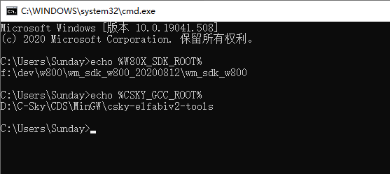
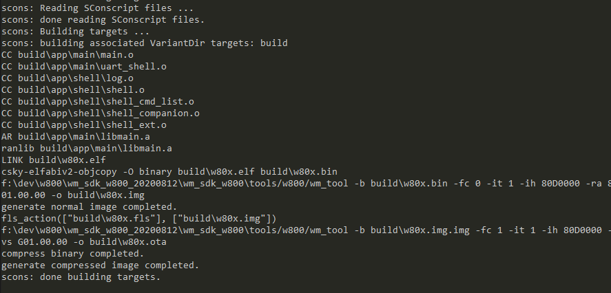
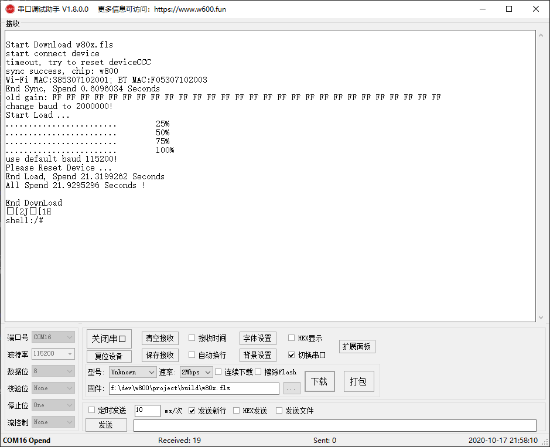
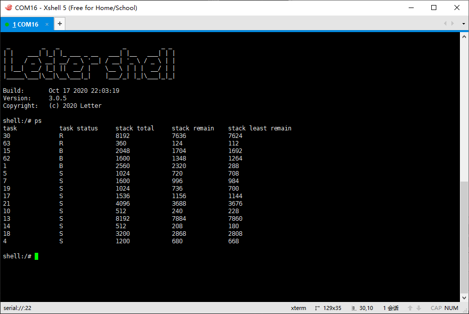
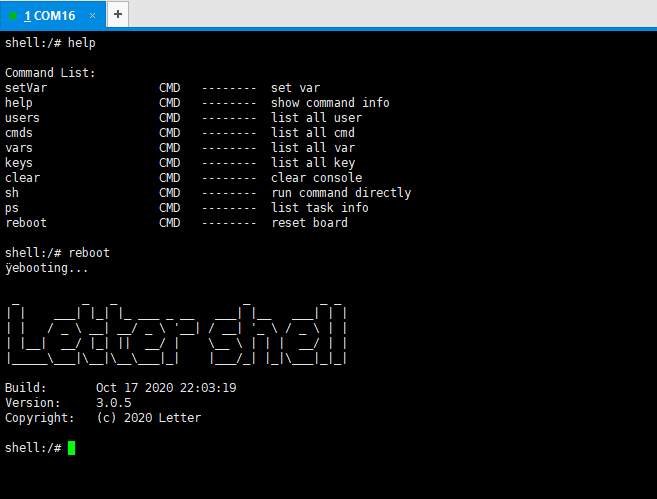

# w80x scons 工程与开发环境搭建

# 优势
1. 使用 `vscode` 开发，相比 `Eclipse CDT` 更轻量级更便捷；
1. 提供 `vscode` 工程文件生成，相比 `CDT`，代码导航准确无误；
1. 应用工程与 SDK 隔离，升级SDK不影响应用工程，应用工程更整洁；
1. 本工程提供 Shell 整合，开发测试更为便捷，体验更好；
1. 工程默认使用 `g++` 进行链接，故可直接使用 `C++` ;

# 劣势
1. 不支持 `gdb` 调试，暂时未提供
1. 代码签名、加密安全暂未加入
1. `scons` 启动速度稍慢于 `make`

# 路线
1. 加入自动烧录工具 实现一键下载
1. 加入代码签名与安全实现

# 步骤
1. 安装 `Scons` 如果你使用过 rt-thread，那env工具里就有，可略过
1. 从[这里](http://www.winnermicro.com/html/1/156/158/558.html)下载 w800 SDK，解压后，设置路径到系统环境变量 `W80X_SDK_ROOT`
1. 从[这里](https://occ.t-head.cn/community/download?id=616214177698021376)下载集成开发环境（含编译器），安装后将目录`C-Sky\CDS\MinGW\csky-elfabiv2-tools` 加入到系统环境变量 `CSKY_GCC_ROOT` 
1. 下载烧录工具 因sdk自带烧录工具要修改才能实现自动下载，为满足不修改SDK的要求，可直接使用联盛德提供的烧录工具，[这里](https://download.w600.fun/tool/ThingsTurn_Serial_Tool.7z)下载 


- 环境变量配置



- scons 安全完成后


# 使用

1. 克隆本工程 `git clone https://github.com/alexsunday/w80xproj.git`
1. 命令行进入工程目录，或使用 vscode 的命令行模式
1. 执行 scons --vscode 自动生成 vscode 工程文件
1. 执行 scons 开始编译
1. 执行 scons -c 执行清理工作，清理后需要重新编译



编译完成后，自动生成了：
1. w80x.elf 原始 ELF 文件，用户一般不用处理，执行 scons -c 时会自动清理
1. w80x.fls 带 second boot 的 固件文件，初次使用可直接烧录此文件
1. w80x.img.img 不带 second boot 的固件文件
1. w80x.ota_gz.img OTA 固件

烧录 fls 后



# 代码

app/main/main.c 中，UserMain即为应用入口，与SDK一致
```C
void UserMain(void)
{
  // 启动 shell
  start_uart_shell();

  // 启动看门狗
  tls_watchdog_init(1000000);
   while(1) {
    tls_watchdog_clr();
    tls_os_time_delay(100);
  }
}

// 示例shell 的使用，提供了两个 shell 指令，分别是 ps 与 reboot
// 在 app/shell/shell_cmd_list.c 中，加入 extern 函数定义，并在 const ShellCommand shellCommandList 定义的最后依葫芦画瓢加入即可
int ps_cmd(int argc, char** argv) ...
int reboot_cmd(int argc, char** argv) ...
```

- 使用 Shell 工具连接使用如下图所示：
ps 命令示例，因 w800 默认线程无名称name字段，所以未予以显示。





# 组织

## 如何使用 C++

工程已经默认使用 `g++` 进行链接了，只需要加入 *.cpp 文件，即回自动加入编译

## 如何新增源文件

应用代码应位于 `app` 目录下，默认已加入 `app/main` 与 `app/shell` 源码文件夹，处于此文件夹中的所有 `.c` 文件与 `.cpp` 文件均会自动加入编译。推荐按不同的功能在`app`中建立文件夹处理，在`app/Sconstruct`的如下段落中增加刚新增的文件夹，如新增 `cloud` 文件夹，则应修改 `app/Sconstruct` 文件如下所示：

```Python
# ... ... 其他内容无需修改

sources = [
    Glob('main/*.c'),
    Glob("main/*.cpp"),
    Glob('shell/*.c'),
    Glob('cloud/*.c'),
    Glob('cloud/*.cpp'), # 如果没有使用 c++ 可无需此行
]

# ... ... 其他内容
```

**注意** 切勿改错，不要修改 `project/Sconstruct` 文件。

## 如何处理源文件INCLUDE

在 `app/Sconstruct` 中，已经将 `app` 目录整体加入了编译器 `INCLUDE` 路径，所以在代码中你只需要按此路径修改相对路径即可。如刚新增的 `cloud` 中，加入了 `cloud.h` ，在 `main/main.c` 中，只需要 

```C
#include "cloud/cloud.h"
```

即可!

如果在 `cloud` 目录下又增加了诸如 `inc` 或 `include` 等目录，可自行修改 `app/Sconstruct` 文件，加入对应目录即可，以 `cloud/include/cloud.h` 目录结构为例，修改 `INCLUDE` 区域至如下示例：

```Python
INCLUDES.extend([
  os.path.abspath(os.path.join(Dir('#').abspath, 'app')),
  # 增加如下这一行，意即加入 `app/cloud/inc` 目录为包含目录
  os.path.abspath(os.path.join(Dir('#').abspath, 'app/cloud/inc')),
])
```

在`main/main.c`中，只需要
```C
#include "cloud.h"
```
即可
