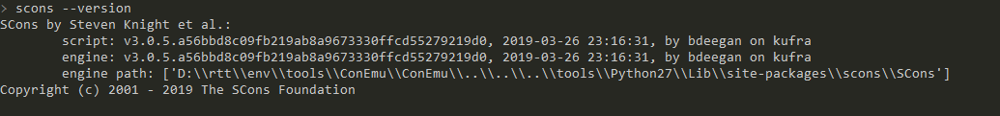

# w80x scons 工程与开发环境搭建

# 优势
1. 使用 `vscode` 开发，相比 `Eclipse CDT` 更轻量级更便捷；
1. 提供 `vscode` 工程文件生成，相比 `CDT`，代码导航准确无误；
1. 应用工程与 SDK 隔离，升级SDK不影响应用工程，应用工程更整洁；
1. 本工程提供 Shell 整合，开发测试更为便捷，体验更好；

# 劣势
1. 不支持 gdb 调试，暂时未提供
1. 代码签名、加密安全暂未加入
1. `scons` 启动速度稍慢于 `make`

# 步骤
1. 安装 `Scons` 如果你使用过 rt-thread，那env工具里就有，可略过
1. 从[这里](http://www.winnermicro.com/html/1/156/158/558.html)下载 w800 SDK，解压后，设置路径到系统环境变量 `W80X_SDK_ROOT`
1. 从[这里](https://occ.t-head.cn/community/download?id=616214177698021376)下载集成开发环境（含编译器），安装后将目录`C-Sky\CDS\MinGW\csky-elfabiv2-tools` 加入到系统环境变量 `CSKY_GCC_ROOT` 
1. 下载烧录工具 因sdk自带烧录工具要修改才能实现自动下载，为满足不修改SDK的要求，可直接使用联盛德提供的烧录工具，[这里](https://download.w600.fun/tool/ThingsTurn_Serial_Tool.7z)下载 


- 环境变量配置


- scons 安全完成后



# 使用

1. 克隆本工程 `git clone `
1. 命令行进入工程目录，或使用 vscode 的命令行模式
1. 执行 scons --vscode 自动生成 vscode 工程文件
1. 执行 scons 开始编译
1. 执行 scons -c 执行清理工作，清理后需要重新编译


编译完成后，自动生成了：
1. w80x.elf 原始 ELF 文件，用户一般不用处理，执行 scons -c 时会自动清理
1. w80x.fls 带 second boot 的 固件文件，初次使用可直接烧录此文件
1. w80x.img.img 不带 second boot 的固件文件
1. w80x.ota_gz.img OTA 固件

烧录 fls 后


TODO:
1. 加入自动烧录工具 实现一键下载
1. 加入代码签名

# 代码

app/main/main.c 中，UserMain即为应用入口，与SDK一致
```C
void UserMain(void)
{
  // 启动 shell
  start_uart_shell();

  // 启动看门狗
  tls_watchdog_init(1000000);
   while(1) {
    tls_watchdog_clr();
    tls_os_time_delay(100);
  }
}

// 示例shell 的使用，提供了两个 shell 指令，分别是 ps 与 reboot
// 在 app/shell/shell_cmd_list.c 中，加入 extern 函数定义，并在 const ShellCommand shellCommandList 定义的最后依葫芦画瓢加入即可
int ps_cmd(int argc, char** argv) ...
int reboot_cmd(int argc, char** argv) ...
```

- 使用 Shell 工具连接使用如下图所示：
ps 命令示例，因 w800 默认线程无名称name字段，所以未予以显示。


